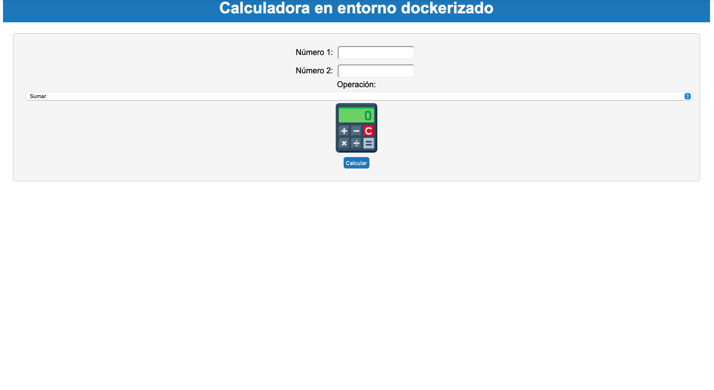

# UT2- Actividad 1: Implantación de arquitecturas web
***Nombre:*** Kelpy Gómez
***Curso:*** 2º de CFGS Desarrollo de Aplicaciones Web.
### ÍNDICE
+ [Introducción](#id1)
+ [Objetivos](#id2)
+ [Material empleado](#id3)
+ [Desarrollo](#id4)
+ [Conclusiones](#id5)

#### ***Introducción***. 
Esta actividad consiste en practicar la manera de implementar una aplicación programada con PHP con herramientas como Nginx y Docker, así como la configuración de los mismos.
#### ***Objetivos***. 
- Implementar una aplicación PHP de calculadora en un entorno servidor.
- Utilizar Nginx como servidor web y conectarlo con la aplicación para poder visualizarla.
- Realizar las configuraciones necesarias para ejecutar Nginx en nuestro ordenador, independientemente del sistema operativo, así como configurar PHP-FPM.
- Hacer uso de un entorno dockerizado e implementar la aplicación.
#### ***Material empleado***. 
- La actividad se ha realizado en un MAC, por lo que el sistema operativo es Linux.
- Docker, Nginx y PHP-FPM
- PHP y CSS
- Máquina virtual Debian.
#### ***Desarrollo***. 

Antes de nada, recalcar que en las capturas aparece el pc13 como primer nombre porque cambiarlo dio demasiados problemas, solo pude cambiar el hostname a a109pc14dpl.

 
  
  ## **ENTORNO NATIVO**
  

- ### Primero, me conecto a mi máquina virtual utilizando ssh.
 

- ### Segundo, en la carpeta donde se encuentra Nginx, creamos la carpeta calculator_php y creamos los dos archivos necesarios (php y css).
 

- ### Después, escribí el código de la aplicación web en php, al que más adelante añadí la imagen de la calculadora.
 

- ### Y escribí su correspondiente css. 
 

- ### Pasé la imagen de la calculadora a la máquina virtual para poder añadirla al código php.
 

 

- ### Y la moví hasta nuestra carpeta del archivo php.
 

- ### Aquí empezaron los problemas y es que creí que al haber cambiado únicamente el hostname, la configuración que había por defecto en la máquina virtual de Andrés se mantendría. Error, me esperaban unas horas de cambios.
 

- ### Cambié el ´location´ en el archivo de configuración de nginx.
 

- ### Y tras actualizar y resetear el servicio de PHP-FPM hasta su última versión, comprobé que funcionaba abriendo el navegador.
  

  
**ENTORNO DOCKERIZADO**

- ### He de confesar que en mi desesperación dockericé el archivo antes de conseguir que Nginx funcionase, con lo cual fui descartando causas del problema. Como primer pasó, creé un Dockerfile que se puede ver en la captura.
 

- ### Después, ‘construí` la imagen y su contenedor. Lo intenté varias veces porque me ponía que el nombre del contenedor ya estaba en uso y supuse que sería porque era la máquina de Andrés, así que lo borré y volví a crearlo después, como puede verse en la imagen.
 

- ### Y la última comprobación, por suerte sin errores:
 

#### ***Conclusiones***. 
Nunca se puede uno confiar de las configuraciones predeterminadas. La actividad era sencilla y frustrante a partes iguales. Es súper importante utilizar un entorno propio en el que poder guardar todas las configuraciones.

